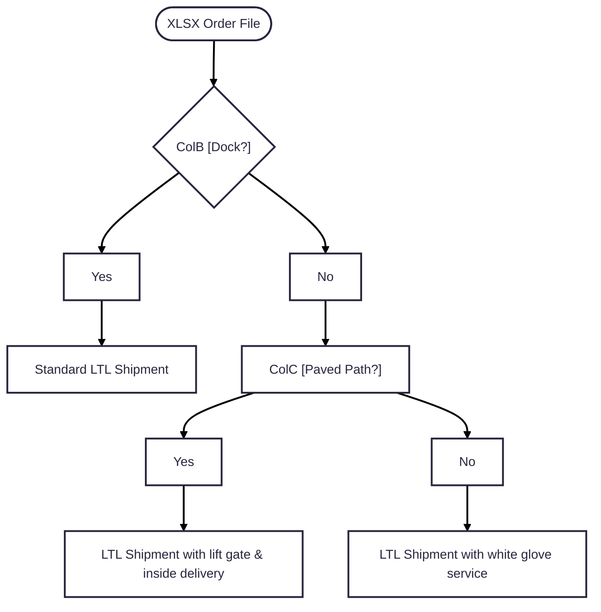

# InquirED Packing Slip Logic

### Shipping Services 
ColB (Dock?) and ColC (Paved Path?) decision logic. These two columns impact the shipping services to be used for a shipment. 

- If the shipment contains < 10 boxes then ship via UPS (This logic is still TBD since the size of individual pieces determines how many items can be packed in a box for TE orders)
- Set the shipment day for 2 days before the Ship Date (ColAD) to ensure shipments don't arrive too early
  - When a shipment doesn't have an Ship Date then assume it should have the same Ship Date as the shipment with the soonesnt Ship Date

### Additional Data Needed on the Slip
- Add ColD (Receiving Days) and ColE (Receiving Hours)
- Add ColJ (Delivery Notes) to special notes section
- Add Col['Appointment Required?'] value

